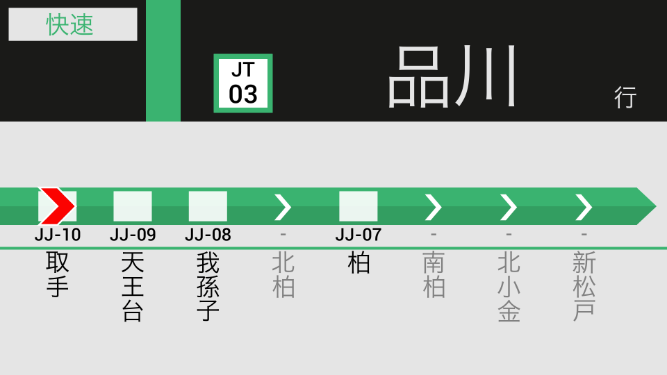
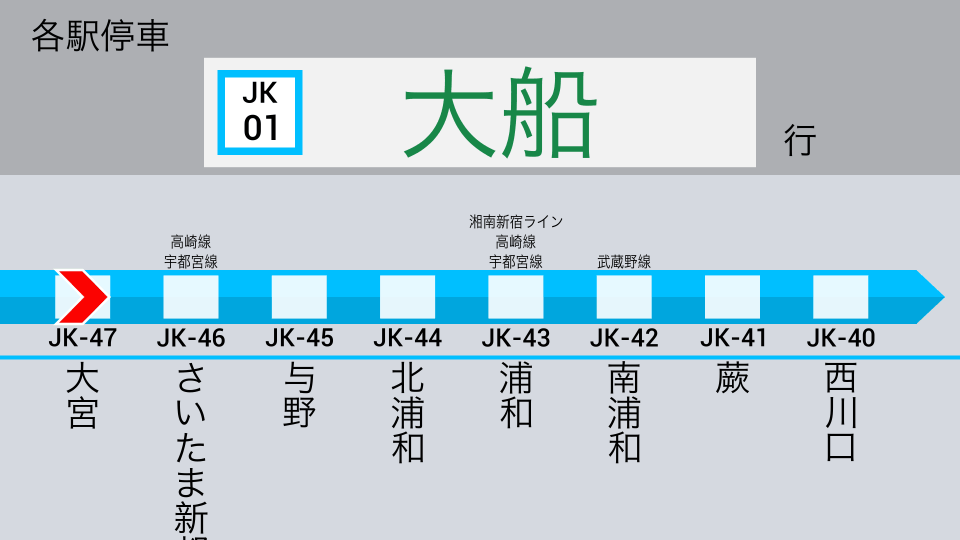

# Metroani

Programatically create multilingual train announcement animations, Japan style.

(From `python examples/gif.py`, `python examples/webm.py`)

# Features

- Most essential settings can be customized in a JSON file or through a Python API
- Script itself can be edited for advanced customization
- Four built-in themes
    - `Metro`: Tokyo Metro light theme with line color as accent. Used by Tokyo Metro
    - `Yamanote`: Dark background for station name. Used by newer JR East lines such as the Yamanote and Joban Lines
    - `JR`: Gray background and older look with more boxes. Used by other JR East lines such as the Keihin-Tohoku and Chuo Lines
    - `Tokyu`: Dark background for station name and circles for stations (TODO). Used by Tokyu Lines

# Examples

TODO: examples for each theme

(The Joban Line using the Yamanote theme `examples/joban.py`)

(The Keihin-Tohoku Line using the JR theme `examples/keihin.py`)

# Installation

1. `git clone https://github.com/twenty5151/metroani`
2. `cd metroani`
3. `pip install -r requirements.txt`
4. (Optional: install `gifsicle` to compress gifs)
5. Start by running `examples/webm.py` and adjusting `settings/gif.json`
6. Read the settings documentation in `settings/README.md`

Notes:

- Running `python metroani/metroani.py` will create a video using development/debugging settings (which should be avoided). Best to experiment `examples/webm.py` and `settings/gif.json`. See `settings/README.md`
- Python 3.9 was used to develop the script, but Python 3.7 (or later) should be fine (as long as it supports `from __future__ import annotations`).

# Usage

Start by running `examples/webm.py` (more optimized than gif and avi), and adjusting `settings/gif.json`. Line 21 controls the duration of the clip that is generated.

The basic workflow for a clean build is:

1. Write the settings in either JSON or Python
2. For JSON, use `all_settings_from_json()` to convert the JSON setting file into Python settings objects
3. For Python, directly instantiate the settings objects. Use `rgb()` to convert 0-255 RGB values to 0-1 values required by gizeh.
4. (Optional: edit the script itself, for advanced users)
5. Pass those settings objects into `make_video()`, which returns a MoviePy clip
6. (Optional: edit the MoviePy clip however you want)
7. Write the MoviePy clip into a file (see their [manual](https://zulko.github.io/moviepy/ref/VideoClip/VideoClip.html#videoclip))

It is encouraged to edit the script, especially the Themes classes

# License

The code is licensed under the Mozilla Public License v2, but it does not apply to any content. Any content you create with this script is fully owned by you, and you have the full copyright over them.

# Credits

Inspired by and external links:

- Tokyo Metro
    - [【自動放送】東西線 中野ゆき B線 05系 東京メトロ LCD再現 トレインビジョン 西船橋始発](https://invidious.snopyta.org/watch?v=6PvKRUFpu0w)
    - [【自動放送】銀座線 A線 浅草 → 渋谷 1000系 東京メトロ LCD再現 トレインビジョン 車内放送 発車メロディ](https://invidious.snopyta.org/watch?v=vuq8JkANTm4)
    - [【自動放送】有楽町線 B線 新木場 → 和光市 LCD再現 東京メトロ トレインビジョン](https://invidious.snopyta.org/watch?v=kEpzDdhgtv4)
- JR new
    - [【自動放送】山手線 内回り車内放送【高輪ゲートウェイ】](https://invidious.snopyta.org/watch?v=KHr2n4neEy8&t=40)
    - [【自動放送】常磐線快速電車 上野→取手【旧放送・架空LCD】](https://invidious.snopyta.org/watch?v=L_urE_tlrVg)
- JR old
    - [【ナンバリング対応】京浜東北･根岸線 北行 各駅停車 全区間車内放送 (トレビ簡易再現)](https://invidious.snopyta.org/watch?v=StY-B--BHNo)
    - [【自動放送】中央線 快速 東京 → 高尾 JR東日本 LCD再現 トレインビジョン 車内放送 発車メロディ](https://invidious.snopyta.org/watch?v=AinHMIO1jfA)
- Tokyu
    - [【自動放送】東急田園都市線•半蔵門線•東武スカイツリーライン 急行 南栗橋ゆき 中央林間始発　2020系 LCD再現 トレインビジョン 車内放送 東京メトロ 東武日光線 ](https://invidious.snopyta.org/watch?v=-5Nejuj2qyk)
