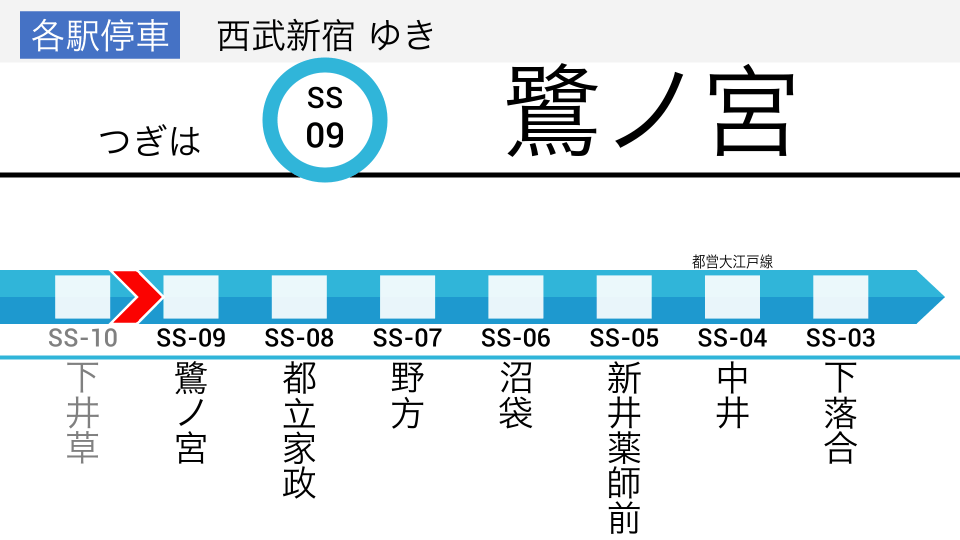

# Metroani

Programatically create multilingual train announcement animations, Japan style.

# Features

- Use JSON to store settings
- A Python API is also available for settings
- Four built-in themes
    - `Metro`: Tokyo Metro light theme with line color as accent. Used by Tokyo Metro
    - `Yamanote`: Dark background for station name. Used by newer JR East lines such as the Yamanote and Saikyo Line
    - `JR`: Gray background and older look with more boxes. Used by other JR East lines such as the Keihin-Tohoku and Chuo Line
    - `Tokyu`: Dark background for station name and circles for stations (TODO). Used by Tokyu Lines

# Examples

1. Git clone and cd to metroani

`python examples/gif.py`

`python examples/webm.py`

`python examples/python_settings.py`

# Usage

1. `git clone https://github.com/twenty5151/metroani`
2. `cd metroani`
3. `pip install -r requirements.txt`
4. (Optional: install `gifsicle` to compress gifs)
5. Start by running the examples and adjusting the settings in `settings/`
