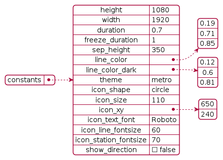
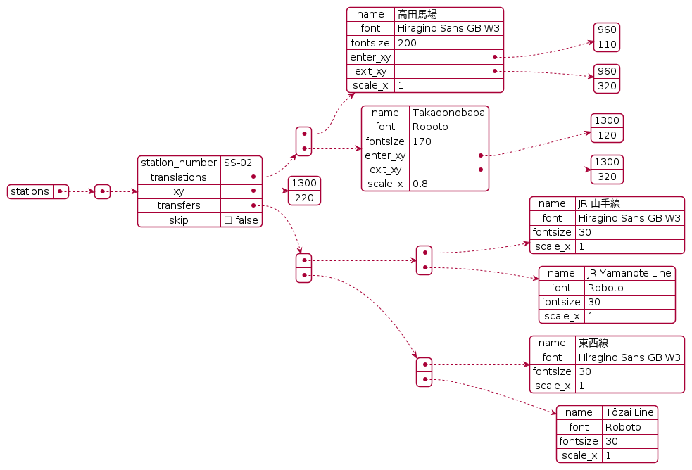
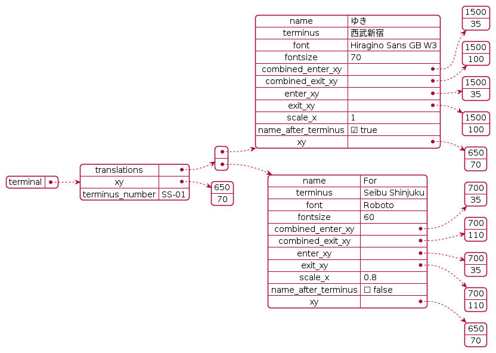
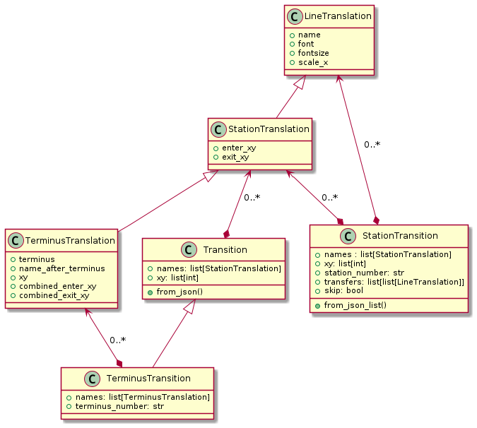

# Example JSON settings

## gif.json

A section of the Seibu-Shinjuku line between Saginomiya to Seibu-Shinjuku, with a 1-second freeze duration and one train state (next). Best for learning/experimenting/tinkering with. Used to generate the header gif in the README. Uses the Metro theme.

## full.json

A section of the Seibu-Shinjuku line between Saginomiya to Seibu-Shinjuku, with a 2-second freeze duration and three train states (next, arriving, currently). Takes a long time to render the full video. Uses the Metro theme.

## joban.json

The Joban line from Toride to Mabashi (actually Kashiwa), with a 1-second freeze duration and one train state (next). The Joban Line doesn't use the Yamanote theme in real life, so here is a mockup of one.

## keihin.json

The Keihin-Tohoku line from Omiya to Kawaguchi, with a 1-second freeze duration and one train state (next). Uses the JR theme.

## den_en_toshi.json

A section of the Tokyu Den-en-toshi line between Azamino to Futako-Shinchi, with a 1-second freeze duration and one train state (next). Uses the Tokyu theme.

## dev.json

For development and debugging purposes, can change at any time. Do not rely on this. Running `python metroani/metroani.py` will create a video with this setting.

# Settings documentation

For xy coordinates, note that the origin is in the top left. Higher x values means to the right, and higher y values mean to the bottom.

There are essentially four separate sections (objects in the Python API)

## Constants

Video-wide settings.

- `height` (int) - height of the video
- `width` (int) - width of the video
- `duration` (float) - how long the transition should take
- `freeze_duration` (int) - how long the station name should remain
- `sep_height` (int) - the height of the separator between station info and the line graphic
- `line_color` (list[float]) - the color of the current train line in 0-1 RGB
- `line_color_dark` (list[float]) - a darker version of `line_color`
- `theme` (string) - the theme to use (any of: 'metro', 'yamanote', 'jr', 'tokyu'). Case insensitive
- `icon_shape` (string) -  the shape of the station icon (any of: 'circle', 'square')
- `icon_size` (int) - for circle, the radius; for square, the side length of the icon
- `icon_xy` (list[int]) - position of the station icon
- `icon_text_font` (string) - font to use for text in the station icon
- `icon_line_fontsize` (int) - font size of the line number in the station icon
- `icon_station_fontsize` (int) - font size of the station number in the station icon

## Stations

Every single station has multiple translations. Each translation has some translation-specific settings, and each station has station-wide (or station-specific) settings.

The values for the "stations" key should be a list of dictionaries (key-value mapping). Each dictionary represents a single station. The keys needed for each dictionary is:

- `station_number` (string) - Some sort of language-agnostic numbering representing that station
- `translations` (list[StationTranslation]) - A list of different translations for this station. See [StationTranslation](#StationTranslation)
- `xy` (list[int]) - the position of the station name (when it is the next station)
- `transfers` (list[list[LineTranslation]]) - The inner list is the line in different languages and their settings. The outer list is all the different lines that can be transferred to. See [LineTranslation](#LineTranslation)
- `skip` (bool) - whether this station is skipped (ie, this train is a rapid service skipping a station served by a local/slower service)

A visualization showing only Takadanobaba station on the Seibu-Shinjuku Line:

## Terminal

The terminus station of the line. Indicates the direction of the train.

The value for the "terminal" key should be a single dictionary. Only two keys are accepted:

- `translations` (list[Translation]) - A list of different translations for the terminus indicator. See [Translation](#Translation)
- `xy` (list[int]) - the position of the text

## States

The 'state' of a train, i.e. whether it is moving or stationary. The 'next' state should always be present as it indicates what the next station is. Train announcements in Japan also shows if the train is arriving at the station and if it is currently stopping in the station. Those states are 'arriving' and 'currently' respectively.

The values for the "states" key should be a dictionary where the key represents the state name and the values represents the settings associated with it. Note that the keys (the name of the states) are ignored, and you are free to name it whatever. The value should be one dictionary, with two keys:

- `translations` (list[Translation]) - A list of different translations for this state. See [Translation](#Translation)
- `xy` (list[int]) - the position of the text

A visualization showing only one state (next):

## Translation

A collection of values that every translation for the terminus and train state.

- `name` (string) - the name of the terminus/state in a language
- `font` (string) - the font to use for this language (some fonts cannot display CJK)
- `fontsize` (int) - font size of this translation
- `scale_x` (int) - horizontal scale of the translation
- `enter_xy` (list[int]) - where the center of the enter transition is
- `exit_xy` (list[int]) - where the center of the exit transition is

## StationTranslation

A collection of values that every station translation has. Remember that this script is for *multilingual* animations, that contains multiple translations of the stations. There needs to be a transition between each translation, so every translation needs to have an enter and exit transition. `enter_xy` and `exit_xy` is best figured out experimentally.

- `name` (string) - the name of the station in a language
- `font` (string) - the font to use for this language (some fonts cannot display CJK)
- `fontsize` (int) - font size of this translation
- `scale_x` (int) - horizontal scale of the translation
- `enter_xy` (list[int]) - where the center of the enter transition is
- `exit_xy` (list[int]) - where the center of the exit transition is

## LineTranslation

A collection of values that every line (that can be transferred to) translation has.

- `name` (string) - the name of the line in a language
- `font` (string) - the font to use for this language (some fonts cannot display CJK)
- `fontsize` (int) - font size of this translation
- `scale_x` (int) - horizontal scale of the translation

## UML diagram

Confused about Translation/StationTranslation/LineTranslation and Transition/StationTransition? Consult the following diagram

